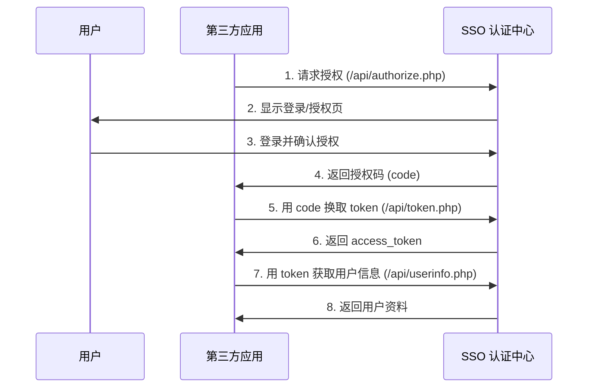

# 爱云科技 SSO - API 接口文档

> **版本**: v2.5.0 | **更新日期**: 2026-03-30 16:00 | **协议**: OAuth2.0 / OpenID Connect

## 📋 目录

1. [OAuth2.0 授权流程](#oauth20-授权流程)
2. [接口列表](#接口列表)
3. [错误码说明](#错误码说明)
4. [调用示例](#调用示例)

---

## OAuth2.0 授权流程



### 授权步骤详解

#### 步骤 1: 引导用户到授权页

```
GET https://sso.aiyun.top/api/authorize.php?
    response_type=code&
    client_id=YOUR_CLIENT_ID&
    redirect_uri=https://your-domain.com/callback&
    scope=userinfo,email&
    state=RANDOM_STATE_STRING
```

**参数说明：**

| 参数 | 必填 | 说明 |
|------|------|------|
| response_type | 是 | 固定为 `code` |
| client_id | 是 | 在管理后台创建的客户端 ID |
| redirect_uri | 是 | 回调地址，必须在后台配置的白名单内 |
| scope | 否 | 申请权限范围，多个用逗号分隔 |
| state | 推荐 | 随机字符串，防止 CSRF 攻击 |

**scope 可选值：**
- `userinfo` - 基本信息（昵称、头像等）
- `email` - 邮箱地址
- `phone` - 手机号码

#### 步骤 2: 用户授权后跳转

用户同意授权后，SSO 会重定向到 `redirect_uri`：

```
https://your-domain.com/callback?code=AUTH_CODE&state=RANDOM_STATE_STRING
```

#### 步骤 3: 用授权码换取 Token

```
POST https://sso.aiyun.top/api/token.php
Content-Type: application/x-www-form-urlencoded

grant_type=authorization_code&
client_id=YOUR_CLIENT_ID&
client_secret=YOUR_CLIENT_SECRET&
code=AUTH_CODE&
redirect_uri=https://your-domain.com/callback
```

**成功响应：**

```json
{
    "access_token": "eyJhbGciOiJIUzI1NiIsInR5cCI6IkpXVCJ9...",
    "token_type": "Bearer",
    "expires_in": 3600,
    "refresh_token": "dGhpcyBpcyBhIHJlZnJlc2ggdG9rZW4...",
    "scope": "userinfo,email"
}
```

#### 步骤 4: 获取用户信息

```
GET https://sso.aiyun.top/api/userinfo.php
Authorization: Bearer ACCESS_TOKEN
```

**成功响应：**

```json
{
    "sub": "1",
    "openid": "oXXXX_XXXXXXXXXXXXXXXX",
    "unionid": "uXXXX_XXXXXXXXXXXXXXXX",
    "nickname": "张三",
    "username": "zhangsan",
    "email": "zhangsan@example.com",
    "avatar": "https://cdn.aiyun.top/avatars/1.jpg",
    "gender": 1,
    "mobile": "138****1234",
    "created_at": "2024-01-01 12:00:00"
}
```

---

## 接口列表

### 1. 授权接口

**URL:** `/api/authorize.php`  
**方法:** GET/POST  
**描述:** OAuth2.0 授权入口

### 2. Token 接口

**URL:** `/api/token.php`  
**方法:** POST  
**描述:** 授权码换取访问令牌

### 3. 用户信息接口

**URL:** `/api/userinfo.php`  
**方法:** GET  
**描述:** 获取当前登录用户信息

### 4. 短信验证码接口

**URL:** `/api/sms.php`  
**方法:** POST  
**描述:** 发送短信验证码

---

## 错误码说明

### OAuth2.0 标准错误

| 错误码 | 说明 |
|--------|------|
| invalid_request | 请求参数错误 |
| unauthorized_client | 客户端未授权 |
| access_denied | 用户拒绝授权 |
| unsupported_response_type | 不支持的响应类型 |
| invalid_scope | 无效的权限范围 |
| server_error | 服务器内部错误 |
| temporarily_unavailable | 服务暂时不可用 |

### 业务错误码

| 错误码 | 说明 |
|--------|------|
| invalid_client | 客户端 ID 或密钥错误 |
| invalid_grant | 授权码无效或已过期 |
| invalid_token | Token 无效或已过期 |
| user_not_found | 用户不存在 |
| unauthorized | 未授权访问 |

---

## 调用示例

### PHP cURL 示例

```php
<?php
// 1. 构建授权 URL
$auth_url = 'https://sso.aiyun.top/api/authorize.php?' . http_build_query([
    'response_type' => 'code',
    'client_id' => 'YOUR_CLIENT_ID',
    'redirect_uri' => 'https://your-domain.com/callback',
    'scope' => 'userinfo,email',
    'state' => bin2hex(random_bytes(16))
]);

header('Location: ' . $auth_url);
exit;

// 2. 回调处理 (callback.php)
if (isset($_GET['code'])) {
    $code = $_GET['code'];
    
    // 换取 Token
    $ch = curl_init('https://sso.aiyun.top/api/token.php');
    curl_setopt($ch, CURLOPT_POST, true);
    curl_setopt($ch, CURLOPT_POSTFIELDS, http_build_query([
        'grant_type' => 'authorization_code',
        'client_id' => 'YOUR_CLIENT_ID',
        'client_secret' => 'YOUR_CLIENT_SECRET',
        'code' => $code,
        'redirect_uri' => 'https://your-domain.com/callback'
    ]));
    curl_setopt($ch, CURLOPT_RETURNTRANSFER, true);
    $response = curl_exec($ch);
    curl_close($ch);
    
    $data = json_decode($response, true);
    $access_token = $data['access_token'];
    
    // 获取用户信息
    $ch = curl_init('https://sso.aiyun.top/api/userinfo.php');
    curl_setopt($ch, CURLOPT_HTTPHEADER, [
        'Authorization: Bearer ' . $access_token
    ]);
    curl_setopt($ch, CURLOPT_RETURNTRANSFER, true);
    $userResponse = curl_exec($ch);
    curl_close($ch);
    
    $user = json_decode($userResponse, true);
    echo '欢迎 ' . $user['nickname'];
}
?>
```

### JavaScript Fetch 示例

```javascript
// 获取用户信息
async function getUserInfo(accessToken) {
    const response = await fetch('https://sso.aiyun.top/api/userinfo.php', {
        method: 'GET',
        headers: {
            'Authorization': `Bearer ${accessToken}`,
            'Content-Type': 'application/json'
        }
    });
    
    if (!response.ok) {
        throw new Error('Token 无效');
    }
    
    return await response.json();
}

// 使用示例
getUserInfo('YOUR_ACCESS_TOKEN')
    .then(user => {
        console.log('用户昵称:', user.nickname);
    })
    .catch(error => {
        console.error('获取失败:', error);
    });
```

---

## 安全建议

1. **State 参数**: 始终使用 state 参数防止 CSRF 攻击
2. **HTTPS**: 生产环境必须使用 HTTPS
3. **Token 存储**: access_token 不要存储在 localStorage，建议使用 httpOnly cookie
4. **Token 刷新**: access_token 过期后使用 refresh_token 刷新
5. **密钥保护**: client_secret 绝对不能暴露在前端代码中

---

**文档版本:** V1.0  
**最后更新:** 2024 年  
**技术支持:** tech@aiyun.top
